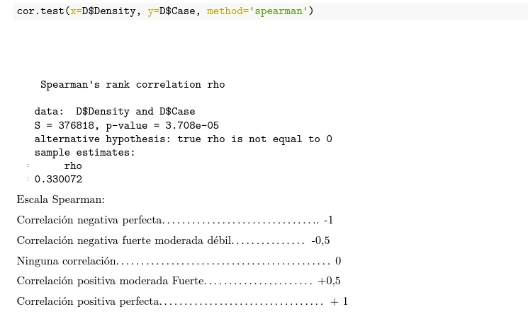

```{r setup, include=FALSE, comment=TRUE}
knitr::opts_chunk$set(echo = FALSE)
library(ggplot2)
library(dplyr)
library(multcomp)
library(psych)
library(car)
library(nlme)
library(lme4)
library(readr)
library(lmtest)
library(sjPlot)
library(readxl)
library(datasets)
library(stats)
library(epiR)
library("shiny")
library(tidyverse)
library(knitr)
library(data.table)
library(DT)

```

## Introducción
- En 2021, en la zona MarineFjordLand se cultivaban salmon del atlatico en 150 centros distribuidos en 5 areas de manejo (A, B, C, D y E).
- De manera repentina comienzan a detectarse mortalidades mayor al 5% diario en distintos centros del area.
- Se intento descubrir el problema o patogeno asociado a la mortalidad sin exito.
- La autoridad sanitaria levantó una encuesta a todos los centros del area para determinar causalidad. A partir de esta información se obtiene la base de datos con la que trabajaremos para este proyecto.

## Introducción


## Análisis exploratorio de datos
I.- Preguntas Iniciales.
¿Cuántas y qué tipo de variables se dispone para el análisis?
8 variables:
1.- Area de manejo (cualitativa nominal), 
2.- Compañia (cualitativa nominal),
3.- Tipo de vacuna (cualitativa nominal),
4.- Temperatura promedio (cuantitativo continuo), 
5.- Densidad (cuantitativo continuo),
6.- Presencia de Sealice (variable aleatoria discreta con distribucion bernoulli),
7.- Enfermedad branquial (variable aleatoria discreta con distribucion bernoulli),
8.- Calidad de smolt (variable aleatoria discreta con distribucion bernoulli).


## Análisis exploratorio de datos
¿Cuales son los tratamientos?
Caso 1 (positivo, es decir mortalidad mayor al 5% diario),

Caso 0 (negativo, es decir no se registra mortalidad mayor al 5% diario), variable aleatoria discreta con distribucion bernoulli

¿La base de datos está completa?, ¿tiene errores?
Si está completa y no tiene errores

¿Es posible responder las causas de mortalidad con los datos disponibles?
Si, es posible.

¿La cantidad de datos y variables permite hacer un análisis estadistico?
Si, el número de observaciones y las variables permiten realizar un análisis estadístico.

## Comentario Final al analisis exploratorio de datos
La base de datos está limpia, completa, existen variables cualitativas y cuantitativas.
La variables cuantitativas no tienen una distribución normal por ende se requiere pruebas no parametricas para un adecuado análisis estadistico.

## Propuesta de Hipotesis
La propuesta de la hipotesis se hizo considerando la relación entre las variables Densidad y Caso

Hipotesis 0: La densidad no esta asociada al caso(1)
Hipotesis 1: La densidad está asociada al caso (1)

Para evaluar la correlación entre dos variables cuantitativas y no parametricas se utilizará la coeficiente rho de Spearman.

## Prueba coeficiente rho dr Spearman



## Interpretación 

En este caso hay correlacion positiva moderada, pero no lineal. 
Y el P value es menor a 0,5 por lo tanto se acepta la hipotesis alternativa es decir hay correlación entre caso (1) y densidad.

## Evaluación de supuestos
1.- Homocedasticidad : no se cumple
2.- Independencia: son independientes
3.- Normalidad: no son normales

## Conclusiones
- Se acepta la hipotesis alternativa (hay correlación entre Densidad y Caso), la correlacion es positiva moderada, y muy posiblemente no lineal.
- De acuerdo con AED, la información disponible permite realizar un adecuado análisis estadístico.