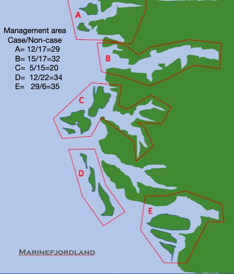

```{r setup, include=FALSE, comment=TRUE}
knitr::opts_chunk$set(echo = FALSE)
library(knitr)
library(kableExtra)
library(ggplot2)
library(dplyr)
library(readxl)
```


## Titulo: "Analisis de caso, mortalidad en MarineFjordland en 2021"

## Introducción

- 


## Análisis exploratorio de datos


## Modelo a utilizar

## Conclusiones
