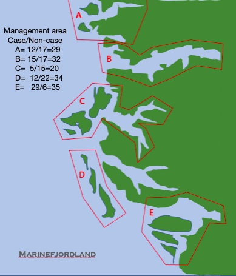

# DiplomadoRPUCV
## Titulo: "Analisis de caso, mortalidad en MarineFjordland en 2021"

## Descripción del problema a resolver

En 2021, en Marinefjordland, un zona de fiordos con 5 areas de manejo, llamadas A, B, C, D y E, donde se cultiva salmón del atlantico, se
vieron afectados 87 de 150 centros de cultivo. 
El problema fue una mortalidad significativa de inicio repentino, comenzando en un nivel
bajo, pero aumentando rápidamente hasta el 5% de la población en riesgo
por día en los sitios afectados. Los datos fueron recopilaron en 2021,
sin resultados concluyentes, no fue posible determinar el patogeno que
lo causó, ni aislarlo.
Por lo tanto la definición de caso fue:
mortalidad significativa de inicio súbito que comienza en un nivel bajo,
pero aumenta rápidamente al 5% o más de la población en riesgo por día
en los sitios afectados. 
El centro de cultivo se considera caso
(1) cuando las mortalidades alcanzan el 5% por día y 
no caso (0) cuando las mortalidades no alcanzan el 5% diario.
Se probaron varios enfoques terapéuticos, pero ninguno ayudo
significativamente a evitar la progresión de la enfermedad (aumento de mortalidad). Se
cosecharon algunos de los sitios afectados, en la medida que la talla se los
permitió, 5 sitios sacrificaron el stock, y en el resto, continuaron su
etapa de engorda. En aquellos sitios que continuaron creciendo las
pérdidas de peces fueron: Mín. 15 %, Máx. 65 %, y Media 45 %.
Los datos fueron recopilados por la autoridad sanitaria nacional competente a
principios de junio de 2021, de 150 granjas. 87 de estos fueron
identificados como casos en ese momento. Los datos disponibles de la
encuesta incluyen:

-   SiteName (Nombre centro)

-   ManagementArea (Area de Manejo)

-   Case (Caso 1/0)

-   MeanWaterTemperature (Temperatura promedio)

-   Density (Densidad)

-   Company (Compañía)

-   Vaccine (Tipo de vacuna)

-   SeaLice (Presencia de Sealice)

-   GillDisease (Enfermedad branquial )

-   FailedSmolt (Calidad smolt)



## Descripción de las variables en estudio, factores a analizar y numero total de observaciones.

Se realiza un análisis exploratorio a la base de datos de 150 centros
de cultivo, con su correspondiente información. Se analizaron 8 variables como se detalla más abajo en preguntas iniciales.

# Preguntas Iniciales
#¿Cuántas y qué tipo de variables se dispone para el análisis?
8 variables: 
Area de manejo (cualitativa nominal),
Compañia (cualitativa nominal), 
Tipo de vacuna (cualitativa nominal),
Temperatura promedio (cuantitativo continuo),
Densidad (cuantitativo continuo),
Presencia de Sealice (variable aleatoria discreta con distribucion bernoulli),
Enfermedad branquial (variable aleatoria discreta con distribucion bernoulli),
calidad de smolt (variable aleatoria discreta con distribucion bernoulli).

#¿Cuales son los tratamientos? 
Caso 1 (positivo, es decir mortalidad mayor al 5% diario),
Caso 0 (negativo, es decir no se observa mortalidad mayor al 5% diario), variable aleatoria discreta con distribucion bernoulli

¿La base de datos está completa?, ¿tiene errores?, ¿está balanceada? trataremos de responder con el análisis exploratorio de los datos
¿Es posible responder las causas de mortalidad con los datos disponibles?
¿la cantidad de datos y variables permite hacer un análisis estadistico?

```{r setup, include=FALSE}
knitr::opts_chunk$set (echo = TRUE)
install.packages("readxl")
library(ggplot2)
library(dplyr)
library(multcomp)
library(psych)
library(car)
library(nlme)
library(lme4)
library(readr)
library(lmtest)
library(sjPlot)
library(readxl)
library(datasets)
library(stats)
library(epiR)
library("shiny")
```
```{r, datos}
D <- read_delim("MarineFjordland.txt")
```
# Resumen y Visualización
```{r}
summarise(D)
```
# Centros de Cultivo por area de Manejo (Barrio)
```{r}
table(D$ManagementArea)
```
# Casos Totales 0=negativo 1= caso positivo
```{r}
table(D$Case, D$ManagementArea)
```
# Histograma Temperatura promedio 
```{r}
ggplot(D, aes(x=D$MeanWaterTemperature))+
  geom_histogram(color="green", fill="lightblue", bins = 10)+theme_classic()+theme(text = element_text(size=20,face="bold",colour="black"))+xlab("Temperatura promedio c°")
```
# Gráfico Bloxpot asociando T° promeddio con Caso
```{r}
boxplot(D$MeanWaterTemperature~D$Case, xlab= "Caso (Positivo=1/Negativo=0)", ylab="T° promedio C°")
```
# QQplot para ver la normalidad de los datos
```{r}
qqnorm(D$MeanWaterTemperature)
qqline(D$MeanWaterTemperature)
```
En este caso, buscaremos la normalidad con otra prueba, ya que la gran mayoria de las observaciones se encuentran en el eje, por lo que la interpretación del valor de P, debería ayudarnos. Otra opción sería realizar un gráfico con una distribución gamma confirmando que los datos no tienen una distribución normal y una asimetría a la izquierda.


```{r}
D$MeanWaterTemperature <- rgamma (150, 1)
qqnorm (D$MeanWaterTemperature)
qqline (D$MeanWaterTemperature)
```
# Histograma Densidad (distribucion binomial con desplazamiento a la derecha)
```{r}
ggplot(D, aes(x=D$Density))+
  geom_histogram(color="green", fill="lightblue", bins = 10)+theme_classic()+theme(text = element_text(size=20,face="bold",colour="black"))+xlab("Densidad")
```
# Gráfico Bloxpot asociando Densidad con Caso
```{r}
boxplot(D$Density~D$Case, xlab= "Caso (Positivo=1/Negativo=0)", ylab="Densidad")
```
# QQplot para ver la normalidad de los datos
```{r}
qqnorm(D$Density)
qqline(D$Density)
```
# De acuerdo a lo que vemos en el qqplot, los datos de Densidad no tienen una distribución normal y tienen una asimetría hacia la izquierda.


# Preguntas Adicionales: Hipotesis nula 
¿La mortalidad observada en los casos positivos está explicada por tipo de vacuna, zona de manejo, temperatura promedio del agua, densidad de cultivo, compañia productora,enfermedad de branquias, presencia de caligus, calidad de smolt?  


# Comentario Final
La base de datos está limpia, completa, existen variables cualitativas y cuantitativas.
La variables cuantitativas no tienen una distribución normal por ende se requiere pruebas no parametricas para un adecuado análisis estadistico.
